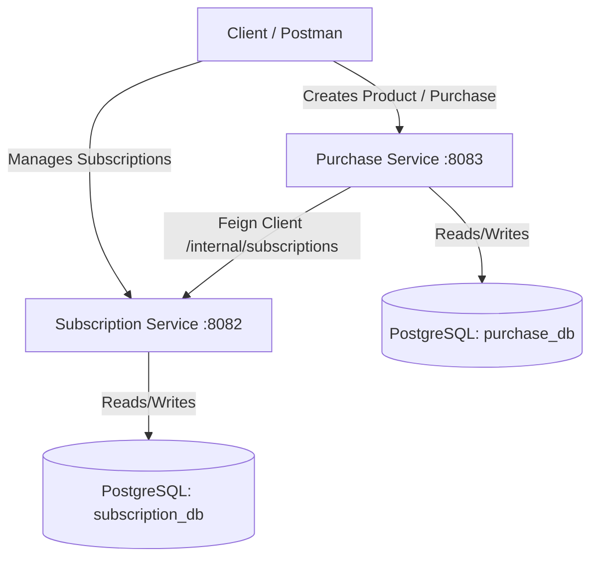

# Subscription & Purchase Management Platform

A microservices-based Subscription and Purchase Management Platform built using **Spring Boot 3.x**, **Java 21**, **Spring Data JPA**, **OpenFeign**, and **PostgreSQL**.

The repository contains two main services:
1. **[Subscription Service](file:///home/probook/Desktop/SubscriptionManagement/subscription/)**: Manages client subscriptions, states (Active, Suspended, Resumed, Cancelled), caching via Caffeine, and scheduling tasks.
2. **[Purchase Service](file:///home/probook/Desktop/SubscriptionManagement/purchase-service/)**: Handles product catalog management and purchases, communicating with the Subscription Service via OpenFeign to register active subscriptions upon purchase.

---

## Architecture Flow



---

## Prerequisites

Ensure you have the following installed on your machine:
- **Java Development Kit (JDK) 21**
- **Maven 3.8+** (or use the provided Maven Wrapper `./mvnw`)
- **PostgreSQL Server** (running locally on port `5432`)

---

## Setup Instructions

### 1. Database Setup
Log into your PostgreSQL command line or GUI tool (e.g., pgAdmin, psql) and create the required databases:

```sql
CREATE DATABASE purchase_db;
CREATE DATABASE subscription_db;
```

If you are using `psql` command line tool:
```bash
psql -U postgres -h 127.0.0.1 -c "CREATE DATABASE purchase_db;"
psql -U postgres -h 127.0.0.1 -c "CREATE DATABASE subscription_db;"
```

### 2. Configure Properties
Each service has its own `application.properties` configuration. If your PostgreSQL credentials are not `postgres` / `root`, update them in the following paths:

*   **Purchase Service**: [purchase-service/application.properties](file:///home/probook/Desktop/SubscriptionManagement/purchase-service/src/main/resources/application.properties)
    ```properties
    spring.datasource.url=jdbc:postgresql://localhost:5432/purchase_db
    spring.datasource.username=postgres
    spring.datasource.password=root
    ```
*   **Subscription Service**: [subscription/application.properties](file:///home/probook/Desktop/SubscriptionManagement/subscription/src/main/resources/application.properties)
    ```properties
    spring.datasource.url=jdbc:postgresql://localhost:5432/subscription_db
    spring.datasource.username=postgres
    spring.datasource.password=root
    ```

---

## Running the Applications

It is recommended to start the **Subscription Service** first so that the **Purchase Service** can communicate with it immediately.

### Step 1: Start Subscription Service
1. Navigate to the `subscription` directory.
2. Build and run the application:
   ```bash
   cd subscription
   ./mvnw spring-boot:run
   ```
   *The service will start on port **`8082`**.*

### Step 2: Start Purchase Service
1. Navigate to the `purchase-service` directory.
2. Build and run the application:
   ```bash
   cd purchase-service
   ./mvnw spring-boot:run
   ```
   *The service will start on port **`8083`**.*

---

## API Endpoints & Testing

### 1. Swagger UI (OpenAPI)
The Subscription Service includes interactive API documentation. Once started, you can view and test its endpoints here:
*   **Subscription Swagger UI**: [http://localhost:8082/swagger-ui/index.html](http://localhost:8082/swagger-ui/index.html)

### 2. Postman Collection
A Postman export file is available in the root directory: **[Postman Endpoints](file:///home/probook/Desktop/SubscriptionManagement/Postman%20Endpoints)**.
*   Import this collection into Postman to quickly test all auth, product, purchase, and subscription endpoints.
*   *Note: If testing direct service ports, adjust the port configurations in your Postman environment (Subscription Service is at `8082` and Purchase Service is at `8083`).*