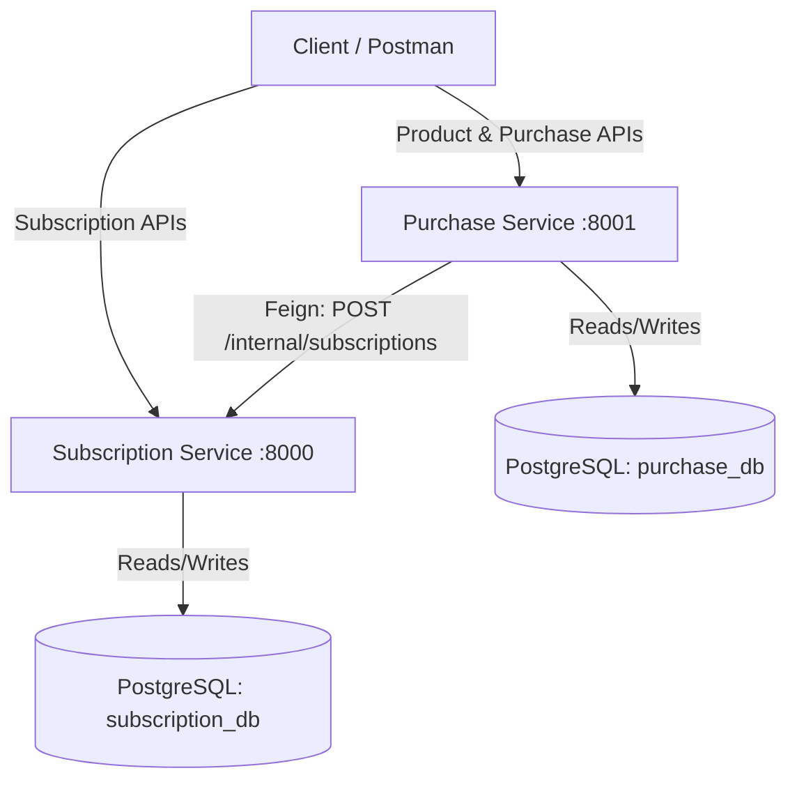

# Subscription & Purchase Management Platform

A microservices-based platform built with **Spring Boot 3.x**, **Java 21**, **Spring Data JPA**, **OpenFeign**, and **PostgreSQL**.

| Service | Directory | Port | Database |
|---|---|---|---|
| Subscription Service | `subscription/` | `8000` | `subscription_db` |
| Purchase Service | `purchase-service/` | `8001` | `purchase_db` |
| Shared Library | `common-lib/` | — | — |

> **Auth is disabled** — `@PreAuthorize` and Spring Security wiring exist in the code but are commented out. This is intentional for the demo.

---

## Architecture



### Inter-Service Flow

```
Client → PurchaseController (8001)
           → PurchaseServiceImpl
               → ProductRepository (purchase_db)
               → PurchaseRepository (purchase_db)
               → SubscriptionClient (OpenFeign)
                    → InternalSubscriptionController (8000)
                         → SubscriptionServiceImpl
                              → SubscriptionRepository (subscription_db)
```

`/internal/subscriptions` is a Feign-only endpoint — called exclusively by Purchase Service, not intended for direct external use.

### Layer Pattern (both services)

```
controller/   thin; delegates to service; returns ResponseEntity
service/      interface + impl/ pattern; all business logic lives here
repository/   JpaRepository + JpaSpecificationExecutor
mapper/       hand-written toEntity/toResponse helpers (no MapStruct)
dto/          request/ and response/ subdirectories
entity/       JPA entities with Lombok @Builder
exception/    one file per exception + GlobalExceptionHandler
config/       Spring @Configuration classes
filter/       OncePerRequestFilter implementations
```

### Shared Library (`common-lib`)

Contains code reused by both services:

| Class | Purpose |
|---|---|
| `com.example.common.filter.RequestLoggingFilter` | Logs every request: `METHOD /path → status (Xms)` |
| `com.example.common.dto.response.ErrorResponse` | Canonical error envelope returned by all exception handlers |

### Subscription State Machine

```
CREATED → ACTIVE → SUSPENDED → ACTIVE   (resume)
CREATED | ACTIVE | SUSPENDED → CANCELLED
ACTIVE → EXPIRED                         (scheduled job)
```

State transitions are enforced in `SubscriptionServiceImpl` — invalid transitions throw `InvalidStateTransitionException`.

### Caching (Subscription Service)

Caffeine cache named `subscriptions`, keyed by subscription ID.
- `@Cacheable` on `getSubscriptionById`
- `@CacheEvict` on every write method
- TTL: 10 minutes, max 100 entries

### Scheduler (Subscription Service)

`SubscriptionExpiryScheduler` flips `ACTIVE` subscriptions past their `expiryDate` to `EXPIRED`.
- Cron expression is configurable via `subscription.expiry.cron` property
- Defaults to daily midnight (`0 0 0 * * *`) in production
- Set to `0/30 * * * * *` in `application.properties` for local development

---

## Prerequisites

- **JDK 21**
- **Maven 3.8+** (or use the included `./mvnw` wrapper)
- **PostgreSQL** running on port `5432`

---

## Setup

### 1. Create databases

```bash
psql -U postgres -c "CREATE DATABASE subscription_db;"
psql -U postgres -c "CREATE DATABASE purchase_db;"
```

### 2. Configure credentials

Update `application.properties` in each service if your PostgreSQL credentials differ from the defaults (`postgres` / `root`):

**`subscription/src/main/resources/application.properties`**
```properties
spring.datasource.url=jdbc:postgresql://localhost:5432/subscription_db
spring.datasource.username=postgres
spring.datasource.password=root
```

**`purchase-service/src/main/resources/application.properties`**
```properties
spring.datasource.url=jdbc:postgresql://localhost:5432/purchase_db
spring.datasource.username=postgres
spring.datasource.password=root
subscription.service.url=http://localhost:8000
```

### 3. Build (from the root — required once before first run)

```bash
mvn clean install
```

This compiles all three modules (`common-lib`, `subscription`, `purchase-service`) and installs `common-lib` to your local Maven repository.

---

## Running

Start Subscription Service **first** — Purchase Service calls it on startup via Feign.

**Terminal 1:**
```bash
cd subscription
./mvnw spring-boot:run
```

**Terminal 2** (after Subscription Service is up):
```bash
cd purchase-service
./mvnw spring-boot:run
```

---

## Commands

Run all commands from within the individual service directory.

```bash
# Build (skip tests)
./mvnw clean package -DskipTests

# Run tests
./mvnw test

# Run a single test class
./mvnw test -Dtest=SubscriptionServiceImplTest

# Run a single test method
./mvnw test -Dtest=PurchaseServiceImplTest#createPurchase_success
```

---

## API Documentation

Both services expose **Swagger UI** once running:

| Service | Swagger UI |
|---|---|
| Subscription | [http://localhost:8000/swagger-ui/index.html](http://localhost:8000/swagger-ui/index.html) |
| Purchase | [http://localhost:8001/swagger-ui/index.html](http://localhost:8001/swagger-ui/index.html) |

Health checks (Spring Actuator):

| Service | URL |
|---|---|
| Subscription | [http://localhost:8000/actuator/health](http://localhost:8000/actuator/health) |

---

## Postman Collection

Two files are provided in the root directory:

| File | Purpose |
|---|---|
| `Postman Endpoints` | Full collection — import into Postman |
| `Postman Environment` | Environment variables — import and select before running requests |

The collection uses environment variables (`{{subscription_service_url}}`, `{{purchase_service_url}}`, `{{subscription_id}}`, `{{product_id}}`, `{{customer_id}}`). Import **both files** and select the `Subscription Management - Local` environment in Postman before sending requests.

---

## Configuration Reference

### Subscription Service (`subscription/src/main/resources/application.properties`)

| Property | Default | Description |
|---|---|---|
| `server.port` | `8000` | Service port |
| `subscription.expiry.cron` | `0/30 * * * * *` | Cron for expiry job (change to `0 0 0 * * *` for production) |
| `subscription.default.duration-days` | `30` | Days added when auto-creating a subscription from a purchase |

### Purchase Service (`purchase-service/src/main/resources/application.properties`)

| Property | Default | Description |
|---|---|---|
| `server.port` | `8001` | Service port |
| `subscription.service.url` | `http://localhost:8000` | Base URL of the Subscription Service (Feign target) |
| `subscription.default.duration-days` | `30` | Subscription duration created on purchase |

---

## Key Design Decisions

- **No MapStruct** — mappers are hand-written `toEntity` / `toResponse` helpers in `mapper/`
- **Feign over RestTemplate** — declarative HTTP client in `client/SubscriptionClient.java`
- **`sortBy` validation** — `SortValidator` in subscription service guards against arbitrary field injection that would cause a 500
- **`common-lib` scope** — `spring-boot-starter-web` is declared `provided` in `common-lib/pom.xml` so it does not create a duplicate on the classpath of consuming services
